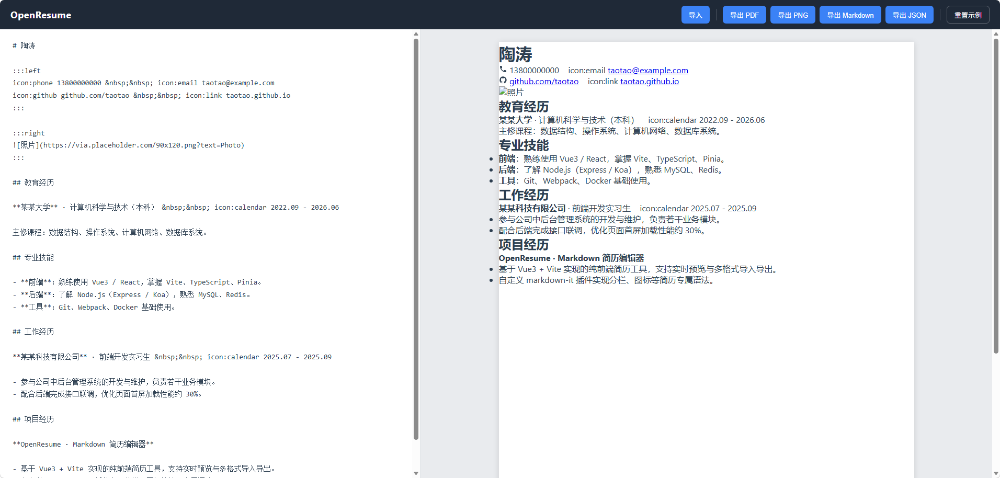

**需求** 不清楚的必须先和我确认好在进行开发。（代码必须要有适当的注释和封装）

- 我现在要做一款类似于 `docs\木及简历（mujicv.com）技术栈拆解` 项目的简历编辑网站
- 目前不需要服务端，主要实现前端，实现编辑简历功能和导出导入功能即可。
- 最好是可以用vue做技术框架

**bugfix** 不清楚的必须先和我确认好在进行开发。（代码必须要有适当的注释和封装）

- 页面渲染和布局错误

