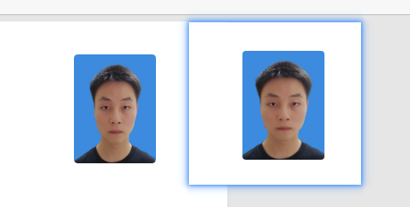
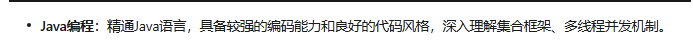
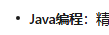
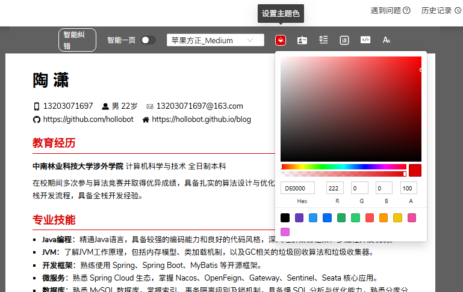
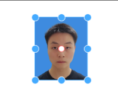
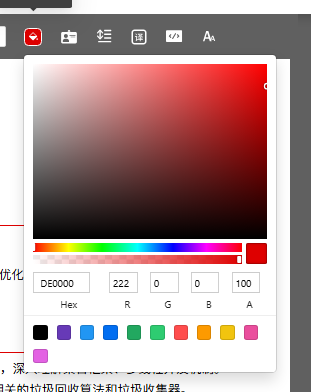

**需求** 不清楚的必须先和我确认好在进行开发。（代码必须要有适当的注释和封装）

- 我现在要做一款类似于 `docs\木及简历（mujicv.com）技术栈拆解` 项目的简历编辑网站
- 目前不需要服务端，主要实现前端，实现编辑简历功能和导出导入功能即可。
- 最好是可以用vue做技术框架


**bugfix** 不清楚的必须先和我确认好在进行开发。（代码必须要有适当的注释和封装）

- 页面渲染和布局错误


**bugfix** 不清楚的必须先和我确认好在进行开发。（代码必须要有适当的注释和封装）

- 导出的照片比例明显不对

- 然后需要简历内容的外边距至少上下一样、左右一样。

- 添加一个苹果方正字体

- 无序列表没有对齐

  - 

  - ```
    <li>
    <p><strong>Java编程</strong>：精通Java语言，具备较强的编码能力和良好的代码风格，深入理解集合框架、多线程并发机制。</p>
    </li>
    ```

- 图标不是很好看，也不是很准确，请提供一个图标库实现可以供用户自己选择用什么图标。

  

**bugfix** 不清楚的必须先和我确认好在进行开发。（代码必须要有适当的注释和封装）

- 简历导出，简历照片模糊了。其实就用原来的照片就可以了，只需要在导入的时候让用户拖动合适的位置，我们只提供一个固定比例大小的窗口。
- 还是没有对齐，列表的图标刚觉有点偏上
- `Spring Boot` `MySQL` `Mybatis-plus` `Redis` `Redisson` `Netty (WebSocket)`  md这个效果没有渲染出来


**需求** 不清楚的必须先和我确认好在进行开发。（代码必须要有适当的注释和封装）

- 提供一个设置主题色的功能。
- 
- 添加一个设置内外编剧的功能，放设置里面
- 证件照尺寸295X413


**bugfix** 不清楚的必须先和我确认好在进行开发。（代码必须要有适当的注释和封装）

- 简历照片的比例不是很好看，请提供高宽的黄金比例，目前个人感觉是太高了。

- 渲染页面的简历现在不仅支持拖动还支持比例缩放。

- 只有点击出现这个状态才可以拖动和缩放，不点击直接是无法操作的。

- 然后主题色板不够丰富请提供图片上面的功能

  


**需求** 不清楚的必须先和我确认好在进行开发。（代码必须要有适当的注释和封装）

- 还是要提供这个色板

只有点击出现这个状态才可以拖动和缩放，不点击直接是无法操作的。样式和这个图片对齐，然后只有点击后才可以操作，没有点击无法操作


**bugfix** 不清楚的必须先和我确认好在进行开发。（代码必须要有适当的注释和封装）

- 简历照片拖动和缩放前提是需要单独点击一下解锁才可以操作，现在是不需要点击直接就能拖动了。
- 简历照片点击后的8个原点布局没有对齐，然后就是中间的点需要红色边框白底的圆，面积要小一点。


**bugfix** 不清楚的必须先和我确认好在进行开发。（代码必须要有适当的注释和封装）

- 导出pdf和png，证件照还是很模糊
- 无序列表的左边距太大了


**bugfix** 不清楚的必须先和我确认好在进行开发。（代码必须要有适当的注释和封装）

- 导出做一个收纳，点击选择导出什么文件。
- 像链接就算导出变成pdf也要是链接，鼠标靠近会变成手指图标


**bugfix** 不清楚的必须先和我确认好在进行开发。（代码必须要有适当的注释和封装）

- `Spring Boot` `MySQL` `Mybatis-plus` `Redis` `Redisson` `Netty (WebSocket)`  渲染的效果没有水平居中 导出pdf显示没有水平居中
- 简历导出成pdf，还是不清晰，有什么办法导出非常清晰的pdf吗


**bugfix** 不清楚的必须先和我确认好在进行开发。（代码必须要有适当的注释和封装）

- 导出的简历 胶囊内的文字还是没居中，整体偏下了。
- 简历导出pdf大小有点大，清晰度提升主要这两个方向去优化
  - 字体出发
  - 第三方库导出pdf高清出发


**bugfix** 不清楚的必须先和我确认好在进行开发。（代码必须要有适当的注释和封装）

- 导出高清pdf布局又错误了。要保证导出来的和网站渲染显示的布局一样
- `docs\cv\Java 开发.pdf` 这个是其他网站导出的高清pdf。


**bugfix** 不清楚的必须先和我确认好在进行开发。（代码必须要有适当的注释和封装）

- 没有修复还是这样


**需求** 不清楚的必须先和我确认好在进行开发。（代码必须要有适当的注释和封装）

- 请给网站添加一个icon，favicon-16x16.png
- 跟新优化readme.md文档


**需求** 不清楚的必须先和我确认好在进行开发。（代码必须要有适当的注释和封装）

- 识别这个项目查看需要优化的地方，以及需要添加哪些新的功能。
