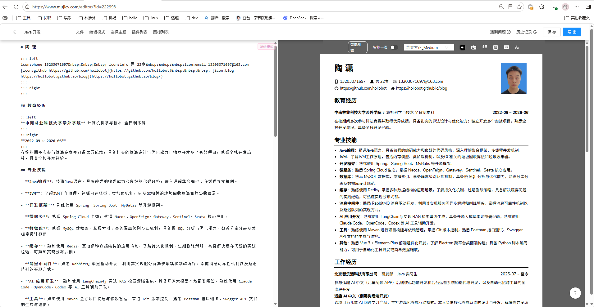

### 木及简历（[mujicv.com](https://link.wtturl.cn/?target=https%3A%2F%2Fmujicv.com&scene=im&aid=497858&lang=zh)）技术栈拆解

该网站是一款 Markdown 驱动的在线简历制作工具，整体采用**Node.js 全栈**技术体系，核心围绕「实时编辑 + 精准渲染 + 高清导出」三大场景做技术选型。

## 参考图

## 一、前端技术栈

1. **核心框架**

   采用 **React + TypeScript** 构建单页应用（SPA），编辑器核心代码为 `src/pages/Editor.tsx`。为保证 Markdown 输入时实时预览的流畅性，团队大量使用 `React.memo`、`useCallback`、`useMemo` 等手段优化组件重渲染，减少输入卡顿。

   

2. **Markdown 解析引擎**

   基于 **markdown-it** 做深度自定义扩展：在标准 Markdown 语法基础上，新增了分栏语法（`:::left`/`:::right`）、图标语法（`icon:phone`）、简历专属区块语法等，同时扩展了主题渲染能力，实现 “一套内容、多套样式” 的切换能力。

   

3. **样式与主题系统**

   采用 CSS 变量 + 类名切换的方式实现多主题模板，所有简历排版通过纯 CSS 精准控制，保证网页预览与导出 PDF 的样式一致性；交互组件以自研轻量组件为主，保证编辑器轻量化。

   

4. **本地数据持久化**

   未登录状态下通过 `localStorage` / IndexedDB 保存简历草稿，实现刷新不丢失；登录后同步至云端。

   

## 二、后端技术栈

1. **服务端框架**

   基于 **Node.js** 开发，核心框架为 **Koa / Express**，招聘信息中明确要求候选人熟悉 Express、Koa、Egg、Nest 等至少一种 Node 框架，整体为典型的 Node.js 全栈架构。

   

2. **数据存储**

   

   - **MySQL**：存储用户账号、简历元数据、模板信息、会员体系等结构化数据。
   - **Redis**：用于用户会话管理、热点数据缓存、接口限流、分布式锁等场景。

   

3. **消息队列**

   采用 **RabbitMQ** 处理异步耗时任务，包括 PDF 导出、AI 内容生成、批量数据处理等，避免阻塞主业务接口，提升并发能力。

   

4. **AI 能力层**

   属于 AIGC 赛道产品，接入大语言模型 API 实现 AI 简历优化、内容生成、智能纠错等功能；同时支持 LangChain 等 AI 工具链辅助开发，对应其 “木及 AI” 相关功能模块。

   

5. **文件存储**

   用户证件照、导出的 PDF 文件等资源，采用云对象存储（如阿里云 OSS / 腾讯云 COS）托管，降低服务器带宽压力。

   

## 三、核心功能的技术实现

1. **实时编辑预览**

   左侧输入区内容变更后，通过自定义的 markdown-it 解析器同步生成 HTML 结构，注入右侧预览区 DOM；配合 React 细粒度的组件更新，实现输入到渲染的毫秒级响应。

   

2. **高清 PDF 导出**

   采用 ** 服务端 Puppeteer（无头 Chrome）** 方案：后端接收简历数据后，渲染完整的简历页面，再调用 Chromium 内核生成 PDF，彻底解决前端导出的分页错乱、字体缺失、样式失真问题；通过 RabbitMQ 异步化处理导出请求，支撑高并发场景。

   

3. **智能一页排版**

   通过前端 JS 计算内容总高度，动态调整字体大小、行间距、区块边距，配合 CSS 分页规则，将 0.5~1.5 页的简历内容自动适配为完整一页，属于排版算法与动态 CSS 结合的实现。

   

4. **智能纠错与翻译**

   接入第三方中文文本纠错接口 + 大模型翻译能力，在编辑过程中实时检测错别字、语法问题，并提供一键优化。