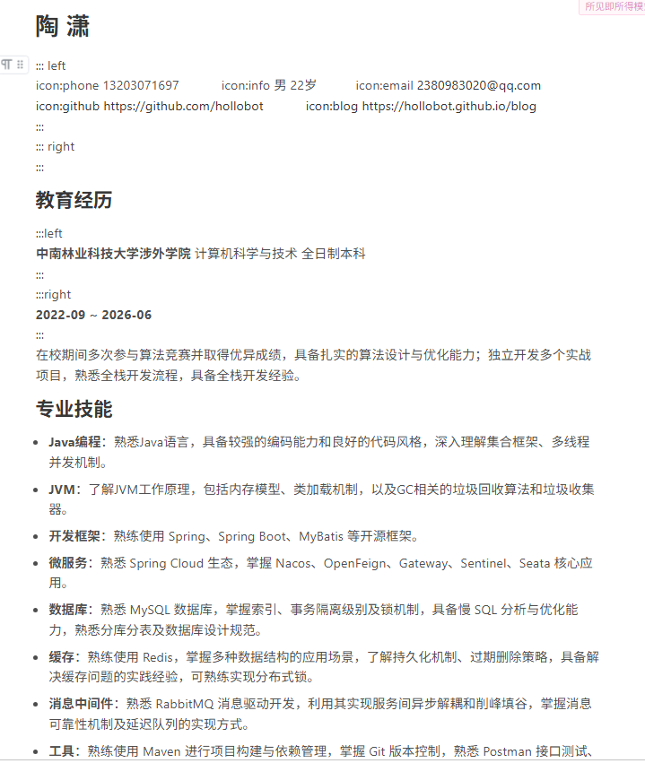
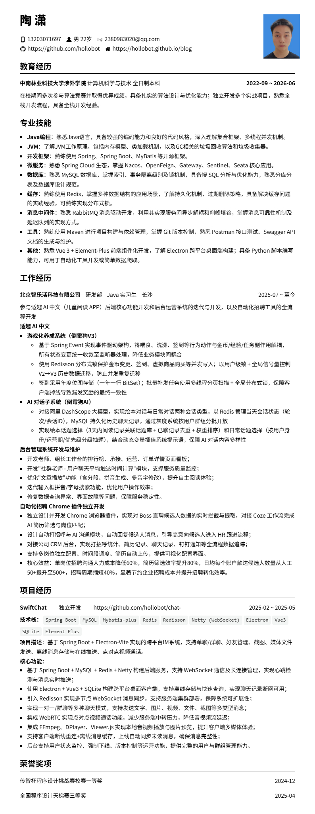

## 源码模式

```
# 陶 潇

::: left
icon:phone 13203071697&nbsp;&nbsp;&nbsp; icon:info 男 22岁&nbsp;&nbsp;&nbsp;icon:email 2380983020@qq.com 
[icon:github https://github.com/hollobot](https://github.com/hollobot)&nbsp;&nbsp;&nbsp; [icon:blog https://hollobot.github.io/blog](https://hollobot.github.io/blog/)
:::
::: right
:::

## 教育经历

:::left
**中南林业科技大学涉外学院** 计算机科学与技术 全日制本科 
:::
:::right
**2022-09 ~ 2026-06**
:::
在校期间多次参与算法竞赛并取得优异成绩，具备扎实的算法设计与优化能力；独立开发多个实战项目，熟悉全栈开发流程，具备全栈开发经验。

## 专业技能

- **Java编程**：熟悉Java语言，具备较强的编码能力和良好的代码风格，深入理解集合框架、多线程并发机制。

- **JVM**：了解JVM工作原理，包括内存模型、类加载机制，以及GC相关的垃圾回收算法和垃圾收集器。

- **开发框架**：熟练使用 Spring、Spring Boot、MyBatis 等开源框架。

- **微服务**：熟悉 Spring Cloud 生态，掌握 Nacos、OpenFeign、Gateway、Sentinel、Seata 核心应用。

- **数据库**：熟悉 MySQL 数据库，掌握索引、事务隔离级别及锁机制，具备慢 SQL 分析与优化能力，熟悉分库分表及数据库设计规范。

- **缓存**：熟练使用 Redis，掌握多种数据结构的应用场景，了解持久化机制、过期删除策略，具备解决缓存问题的实践经验，可熟练实现分布式锁。

- **消息中间件**：熟悉 RabbitMQ 消息驱动开发，利用其实现服务间异步解耦和削峰填谷，掌握消息可靠性机制及延迟队列的实现方式。

- **工具**：熟练使用 Maven 进行项目构建与依赖管理，掌握 Git 版本控制，熟悉 Postman 接口测试、Swagger API 文档的生成与维护。

- **其他**：熟悉 Vue 3 + Element-Plus 前端组件化开发，了解 Electron 跨平台桌面端构建；具备 Python 脚本编写能力，可用于自动化工具开发或简单数据爬取。

## 工作经历

:::left
**北京智乐活科技有限公司** &nbsp;&nbsp; 研发部 &nbsp;&nbsp; Java 实习生 &nbsp;&nbsp; 长沙
:::
:::right
2025-07 ~ 至今
:::

参与适趣 AI 中文（儿童阅读 APP）后端核心功能开发和后台运营系统的迭代与开发，以及自动化招聘工具的全流程开发

**适趣 AI 中文**

- **游戏化养成系统（倒霉狗V3）**

  - 基于 Spring Event 实现事件驱动架构，将喂食、洗澡、签到等行为动作与金币/经验/任务副作用解耦，所有状态变更统一收敛至监听器处理，降低业务模块间耦合

  - 使用 Redisson 分布式锁保护金币变更、签到、虚拟商品购买等并发写入；以用户级锁 + 全局信号量控制 V2→V3 历史数据迁移，防止并发重复迁移

  - 签到采用年度位图存储（一年一行 BitSet）；批量补发任务使用多线程分页扫描 + 全局分布式锁，保障客户端掉线导致漏发奖励的最终一致性

- **AI 对话子系统（倒霉狗AI）**

  - 对接阿里 DashScope 大模型，实现绘本对话与日常对话两种会话类型，以 Redis 管理当天会话状态（轮次/会话ID），MySQL 持久化历史聊天记录，通过灰度系统按用户群组分批开放

  - 实现绘本话题选择（3天内阅读记录关联话题库 + 已聊记录去重 + 权重排序）和日常话题选择（按用户身份/运营期/优先级分级抽题），结合动态变量插值系统提示语，保障 AI 对话内容多样性

**后台管理系统开发与维护**

- 开发老师、组长工作台的排行榜、承接、运营、订单详情页面看板；
- 开发"社群老师 - 用户聊天平均触达时间计算"模块，支撑服务质量监控；
- 优化"文章播放"功能（含分段、拼音生成、多音字修改），提升自主阅读体验；
- 迭代输入框拼音/字母搜索功能，优化用户操作效率；
- 修复数据查询异常、界面故障等问题，保障服务稳定性。

**自动化招聘 Chrome 插件独立开发**

- 独立设计并开发 Chrome 浏览器插件，实现对 Boss 直聘候选人数据的实时拦截与提取，对接 Coze 工作流完成 AI 简历筛选与岗位匹配；
- 设计自动打招呼与 AI 沟通模块，自动回复候选人消息，引导高意向候选人进入 HR 跟进流程；
- 对接公司 CRM 后台，实现打招呼统计、简历记录、聊天记录、钉钉通知等全流程数据追踪；
- 支持多岗位独立配置、时间段调度、简历自动上传，提供可视化配置界面。
- 核心效益：单岗位招聘沟通人力成本降低60%，简历筛选效率提升80%，日均每个账户触达候选人数量从人工50+提升至500+，招聘周期缩短40%，显著节约企业招聘成本并提升招聘转化效率。

## 项目经历

:::left
**SwiftChat**&nbsp;&nbsp;&nbsp;&nbsp;&nbsp;&nbsp;&nbsp;&nbsp;&nbsp;&nbsp;独立开发&nbsp;&nbsp;&nbsp;&nbsp;&nbsp;&nbsp;&nbsp;&nbsp;&nbsp;&nbsp;https://github.com/hollobot/chat-server.git
:::
:::right
2025-02 ~ 2025-05
:::
**技术栈：** `Spring Boot` `MySQL` `Mybatis-plus` `Redis` `Redisson` `Netty (WebSocket)` `Electron` `Vue3` `SQLite` `Element Plus`
**项目描述**：基于 Spring Boot + Electron-Vite 实现的跨平台IM系统，支持单聊/群聊、好友管理、截图、媒体文件发送、离线消息存储与在线推送、点对点视频通话。
**核心功能：**

- 基于 Spring Boot + MySQL + Redis + Netty 构建后端服务，支持 WebSocket 通信及长连接管理，实现心跳检测与消息实时推送；
- 使用 Electron + Vue3 + SQLite 构建跨平台桌面客户端，支持离线存储与快速查询，实现聊天记录断网可用；
- 引入 Redisson 实现多节点 WebSocket 消息同步，支持服务端集群部署，保障系统可扩展性；
- 实现一对一/群聊等多种聊天模式，支持发送文字、图片、视频、文件、截图等多类型消息；
- 集成 WebRTC 实现点对点视频通话功能，减少服务端中转压力，降低音视频流延迟；
- 集成 FFmpeg、DPlayer、Viewer.js 实现本地音视频播放与图片预览，提升客户端多媒体体验；
- 支持客户端断线重连+离线消息缓存，上线自动同步未读消息，确保消息完整性；
- 后台支持用户状态监控、强制下线、版本控制等运营功能，提供完整的用户与群组管理能力。

## 荣誉奖项

:::left
传智杯程序设计挑战赛校赛一等奖
:::
:::right
2024-12
:::

:::left
全国程序设计天梯赛三等奖
:::
:::right
2025-04
:::
```

## 所见即所得模式



## 渲染后的简历

